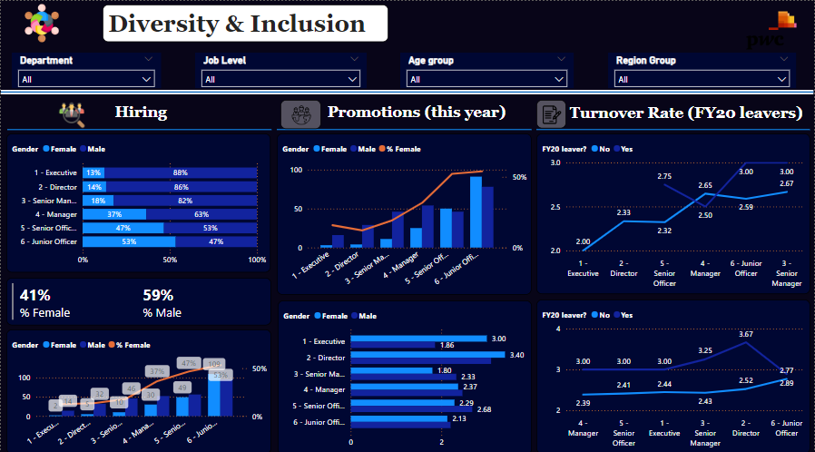
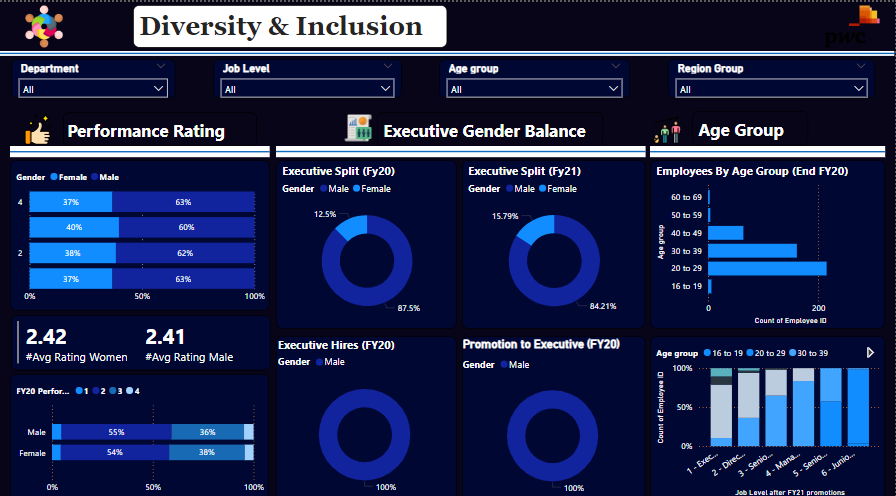
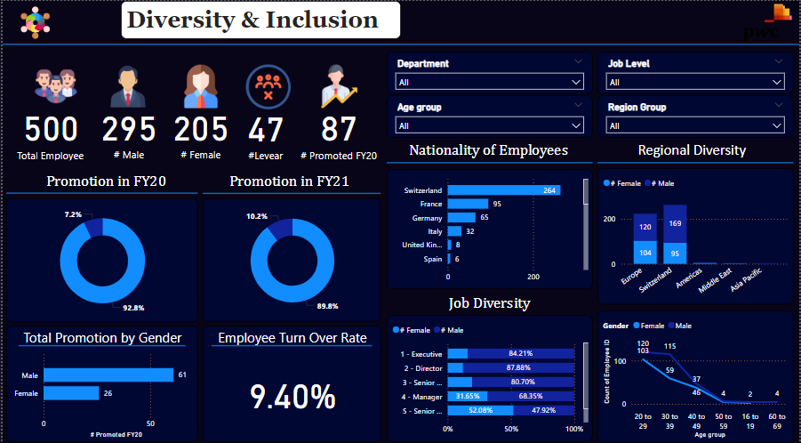

## Diversity-and-Inclusion-Dashboard
### Overview
This repository contains a Power BI dashboard focused on diversity and inclusion metrics within the organization. By highlighting key areas, the report provides stakeholders with clear insights into the organization’s current diversity landscape and tracks progress over time, supporting informed decision-making in these critical areas.
### Key Metrics
- **Gender Distribution:** Breakdown of male and female employees across different job levels.
- **Performance Ratings:** Average performance ratings for male and female employees.
- **Promotions and Turnover:** Analysis of promotion rates and turnover rates by gender and job level.
- **Demographic Analysis:** Age distribution and regional diversity of employees.
- **Departmental Insights:** Performance review assessment (PRA) statuses by department and job level.

### Dashboards
This page provides a high-level summary of diversity and inclusion metrics, including gender distribution and overall performance ratings.

#
This page dives deeper into specific metrics such as promotion rates, employee turnover, and demographic breakdowns by department and job level.

#
This page highlights trends over time and key insights derived from the data, helping to identify areas of improvement and success in diversity and inclusion efforts.

### Conclusion
This Power BI dashboard delivers an in-depth analysis of diversity and inclusion within the organization by utilizing a comprehensive set of metrics. It examines areas such as gender distribution, performance ratings, promotion and turnover rates, and demographic details. The report sheds light on both successes and areas for improvement in creating a more inclusive workplace. The insights gathered from this analysis serve as a valuable resource for shaping strategic decisions and initiatives to strengthen diversity and inclusion efforts.

